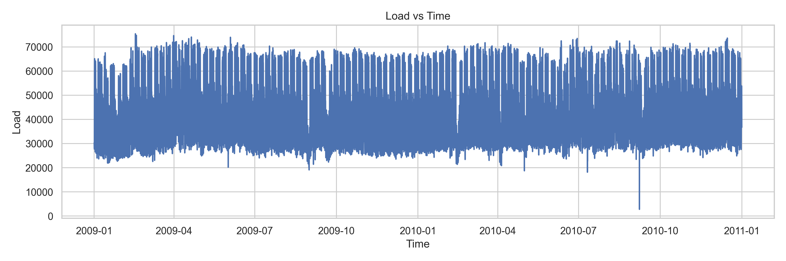
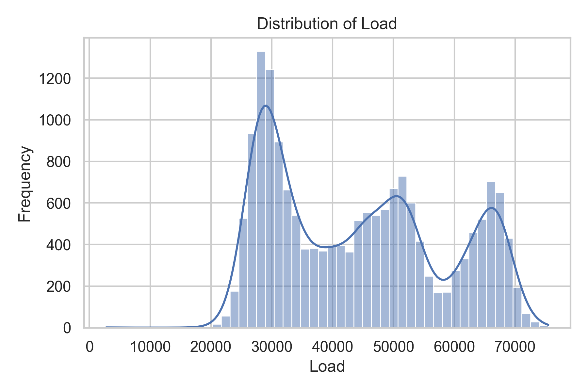
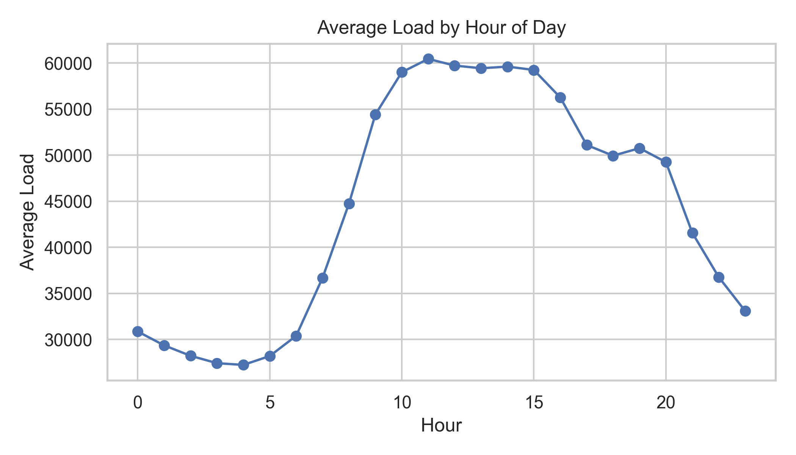
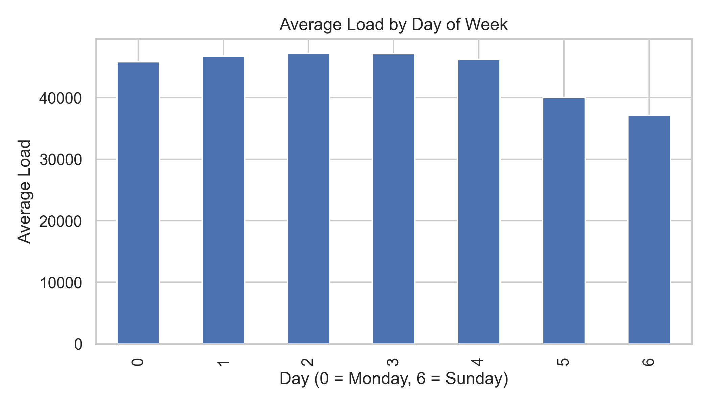
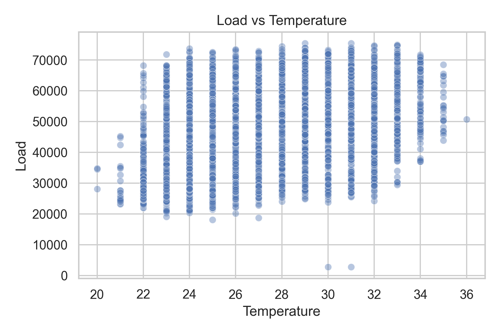
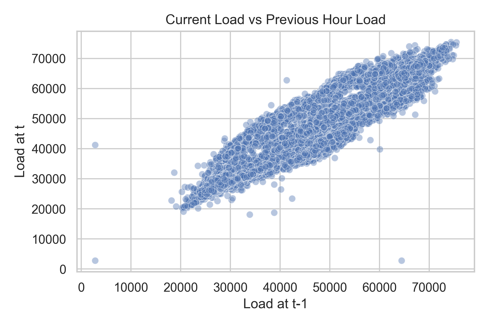
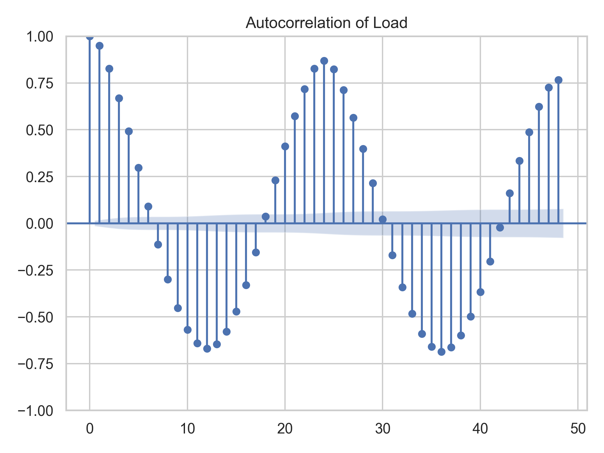
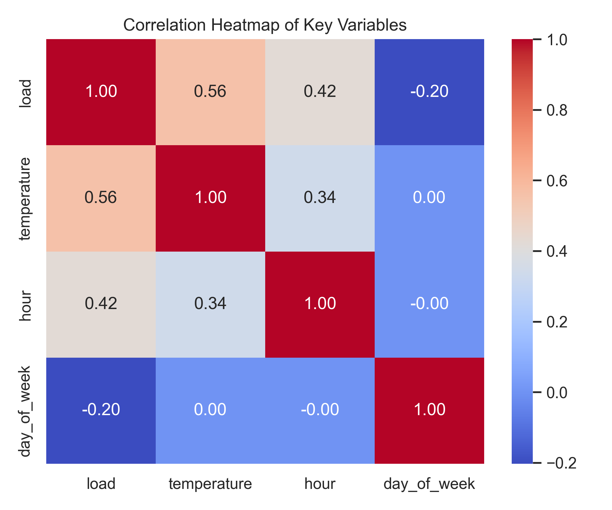

# Short-Term Load Forecasting using Machine Learning

---

# Overview

Short-Term Load Forecasting (STLF) predicts electricity demand for the next few hours up to 24 hours ahead. Accurate forecasting helps power utilities efficiently schedule electricity generation, manage energy distribution, reduce operational costs, and maintain grid stability.

Electricity demand varies due to several factors such as:

- Temperature
- Time of day
- Seasonal patterns
- Human activity

Traditional statistical models often struggle to capture these nonlinear patterns. In this project, multiple machine learning models are implemented and compared to improve the accuracy of short-term electricity load forecasting.

---

# Table of Contents

- Overview
- Problem Statement
- Dataset Information
- Methodology
- Exploratory Data Analysis
- Data Preprocessing Pipeline
- Machine Learning Models
- Evaluation Metrics
- Results
- Observations
- Project Structure
- Installation
- Usage
- Future Improvements
- References

---

# Problem Statement

Electricity load fluctuates continuously due to dynamic factors such as weather, time of day, and human behavior. Traditional forecasting approaches like ARIMA and linear regression often fail to capture complex nonlinear dependencies in the data.

This project aims to build and compare machine learning models capable of learning these complex relationships and producing accurate short-term electricity load forecasts.

---

# Dataset Information

The dataset used in this project contains hourly electricity load measurements along with weather-related variables.

## Dataset Characteristics

- Hourly electricity demand values
- Timestamp-based time series
- Temperature data as external variable
- Continuous time coverage
- Suitable for time-series forecasting

## Key Variables

| Feature | Description |
|---|---|
| Timestamp | Date and time of measurement |
| Load | Electricity demand |
| Temperature | Weather temperature |

The dataset enables analysis of daily patterns, weekly seasonality, and weather impacts on electricity demand.

---

# Methodology

The project follows a structured machine learning pipeline:

1. Data Understanding
2. Exploratory Data Analysis
3. Feature Engineering
4. Data Preprocessing
5. Model Development
6. Model Evaluation
7. Performance Comparison

---

# Exploratory Data Analysis (EDA)

EDA was conducted to understand the underlying patterns and dependencies in the dataset.

## Load vs Time

- Shows overall trend and seasonality.



---

## Load Distribution

- Analyzes statistical spread of load values.



---

## Average Load by Hour

- Identifies peak and off-peak electricity consumption hours.



---

## Average Load by Day of Week

- Highlights differences between weekday and weekend consumption.



---

## Load vs Temperature

- Examines relationship between weather and electricity demand.



---

## Current Load vs Previous Hour Load

- Demonstrates strong temporal dependency in electricity demand.



---

## Autocorrelation Analysis

- Shows correlation across time lags.



---

## Correlation Heatmap

- Displays relationships between features.



---

# Data Preprocessing Pipeline

Raw time-series data cannot be directly used for machine learning models. A step-by-step preprocessing pipeline was implemented.

---

## 1. Data Loading & Timestamp Processing

- Load dataset from CSV
- Convert timestamp to datetime format
- Sort data chronologically

### Purpose

- Preserve temporal order
- Prevent data leakage

---

## 2. Time-Based Feature Extraction

Extracted features:

- Hour of day
- Day of week
- Day of month
- Month
- Weekend indicator

### Purpose

- Capture periodic demand patterns

---

## 3. Lag Feature Generation

Historical load values were added as features.

### Load lags

- 1 hour
- 2 hours
- 3 hours
- 24 hours
- 48 hours
- 168 hours

### Temperature lags

- 1 hour
- 24 hours

### Purpose

- Provide historical context for forecasting

---

## 4. Rolling Statistical Features

Rolling statistics capture short-term trends.

### Features

- Rolling mean (3h, 6h, 24h)
- Rolling standard deviation (24h)

### Purpose

- Smooth fluctuations
- Capture demand volatility

---

## 5. Cyclical Encoding

Time features were encoded using sine and cosine transformations.

### Applied to

- Hour of day
- Day of week

### Purpose

- Preserve cyclical nature of time

---

## 6. Data Cleaning

- Missing values introduced by lag operations were removed
- Invalid records handled properly

---

## 7. Time-Aware Train-Test Split

Dataset split:

- 80% Training Data
- 20% Testing Data

Chronological splitting ensures realistic forecasting evaluation.

---

## 8. Feature Scaling

- Standardization applied only for SVR
- Tree-based models do not require scaling

---

# Machine Learning Models

Four machine learning algorithms were implemented.

---

## Random Forest Regressor

Random Forest is an ensemble learning method that builds multiple decision trees and combines their predictions.

### Key advantages

- Reduces overfitting
- Handles nonlinear relationships
- Provides stable predictions

---

## Support Vector Regression (SVR)

SVR is a kernel-based regression technique that attempts to fit data within a specified error margin.

### Key characteristics

- Margin-based regression
- Uses kernel functions
- Effective for high-dimensional data

---

## XGBoost

XGBoost (Extreme Gradient Boosting) is an optimized gradient boosting algorithm designed for high performance.

### Key features

- Gradient boosting framework
- Regularization to prevent overfitting
- Parallel processing
- Efficient tree pruning

---

## CatBoost

CatBoost is a gradient boosting algorithm optimized for handling categorical features.

### Key advantages

- Native categorical handling
- Ordered boosting to reduce bias
- Symmetric tree structure

---

# Evaluation Metrics

Several regression metrics were used to evaluate model performance.

---

## RMSE (Root Mean Square Error)

Measures square root of average squared prediction errors.

Higher penalty for large errors.

---

## MAE (Mean Absolute Error)

Average absolute difference between predicted and actual values.

---

## MAPE (Mean Absolute Percentage Error)

Measures error relative to actual values in percentage form.

---

## sMAPE (Symmetric Mean Absolute Percentage Error)

Improved version of MAPE that reduces bias.

---

## R² Score

Measures how well the model explains variance in the data.

Range:

- 0 = Poor model
- 1 = Perfect prediction

---

## MBE (Mean Bias Error)

Indicates systematic prediction bias.

- Positive → Underprediction
- Negative → Overprediction

---

# Results

## Model Predictions

### XGBoost – Actual vs Predicted


---

### Random Forest – Actual vs Predicted


---

### SVR – Actual vs Predicted


---

### CatBoost – Actual vs Predicted


---

## Performance Comparison

| Model | RMSE | MAE | MAPE | sMAPE | R² |
|---|---|---|---|---|---|
| Random Forest | 2019 | 1093 | 3.02% | 2.43% | 0.979 |
| SVR | 4212 | 3048 | 7.77% | 6.79% | 0.909 |
| XGBoost | 1927 | 1205 | 3.23% | 2.73% | 0.981 |
| CatBoost | 2262 | 1448 | 4.04% | 3.35% | 0.974 |

---

# Observations

## Key Findings

- XGBoost achieved the best overall performance
- Random Forest performed closely behind XGBoost
- SVR showed comparatively weaker performance
- Tree-based models effectively captured nonlinear patterns

## Conclusion

XGBoost proved to be the most effective model for short-term load forecasting in this dataset.

---

# Project Structure

```bash
Short-Term-Load-Forecasting/
│
├── Data/
├── EDA/
├── Models/
├── plots/
├── preprocessing/
├── Preprocessing_outputs/
├── Trained_models/
├── README.md
└── requirements.txt
```

---

# Installation

Clone the repository:

```bash
git clone https://github.com/yourusername/Short-Term-Load-Forecasting.git
```

Install dependencies:

```bash
pip install -r requirements.txt
```

---

# Usage

Run preprocessing:

```bash
python preprocessing/preprocessing.py
```

Train models:

```bash
python Models/random_forest.py
```

---

# Technologies Used

- Python
- Pandas
- NumPy
- Matplotlib
- Scikit-learn
- XGBoost
- CatBoost
- Statsmodels

---

# Future Improvements

Potential improvements include:

- Deep learning models (LSTM, GRU)
- Transformer-based forecasting
- Additional weather variables
- Real-time forecasting system
- Probabilistic forecasting

---

# References

1. Brownlee, J. *Machine Learning Mastery*
2. XGBoost Documentation
3. CatBoost Documentation
4. Scikit-learn Documentation
5. Time Series Forecasting Research Papers

---

# Author

**Vikas Pabbathi**

If you found this project useful, consider giving it a ⭐ on GitHub.
